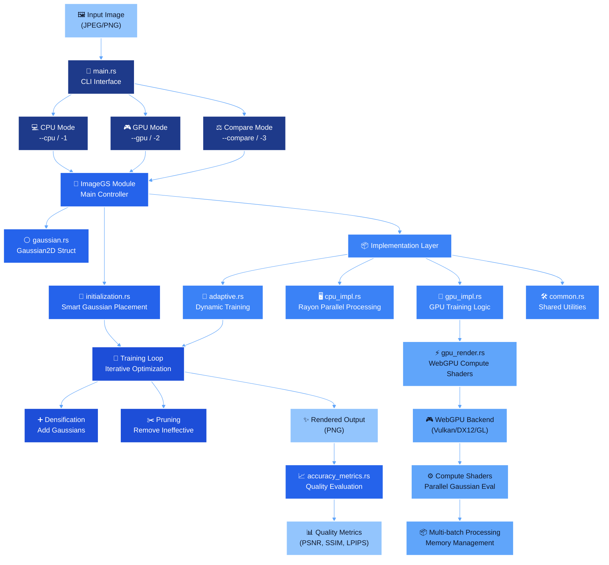

# 2D Gaussian Splatting Renderer

A high-performance Rust implementation of 2D Gaussian Splatting for image representation and reconstruction using both CPU and GPU acceleration.

## Overview

This project implements **Image-GS**, a content-adaptive image representation method that uses anisotropic 2D Gaussians for efficient, high-fidelity image compression and rendering. The system can fit a collection of 2D Gaussians to approximate any input image through an iterative training process.

### Features

- **Dual Rendering Modes**: CPU and GPU implementations for maximum compatibility
- **Content-Adaptive Initialization**: Smart Gaussian placement based on image content and edge detection
- **Adaptive Training**: Dynamic learning rates and densification strategies
- **Quality Metrics**: Comprehensive evaluation including PSNR, SSIM, and LPIPS
- **Multi-batch GPU Processing**: Handles large Gaussian collections efficiently
- **Robust Error Handling**: Automatic GPU device recovery and fallback mechanisms

## Technical Architecture



### Core Components

- **Gaussian2D**: 2D Gaussian **primitives** with position, scale, rotation, and color
- **ImageGS**: Main **controller** for Gaussian collections and training
- **GpuRenderer**: **WebGPU** compute shader implementation for accelerated rendering 
- **Accuracy Metrics**: **PSNR**, **SSIM**, and **LPIPS** quality evaluation

### Key Algorithms

**Initialization**: **Three-tier** approach with 60% **grid-based** placement, 25% **edge detection**, and 15% **content-aware** random sampling.

**Training**: **Adaptive** learning rates, smart **densification** in high-error regions, **pruning** of ineffective Gaussians, and GPU render **caching** .

## Installation

### Prerequisites

- **Rust**: Latest stable version
- **GPU Support**: Intel Arc or compatible WebGPU device (for GPU mode)

### Build

```bash
cargo build --release
```

## Usage

Basic execution modes :

```bash
./target/release/gauss-render -1    # CPU mode
./target/release/gauss-render -2    # GPU mode (Intel Arc recommended)
./target/release/gauss-render -3    # Comparison mode (both CPU and GPU)
```

Custom parameters :
```bash
./target/release/gauss-render -2 --image path/to/image.jpg --iterations 500 --width 800 --height 600
```

Run `./target/release/gauss-render --help` for full usage information.

### Output Files

The system generates several outputs:
- `cpu_final_output.png` / `gpu_final_output.png`: Final rendered results
- `iterations_gpu/`: Training progress snapshots (GPU mode)
- Quality metrics printed to console

## Performance Characteristics

### GPU Acceleration

The GPU implementation  provides significant performance improvements:
- **Compute Shaders**: Parallel Gaussian evaluation using WebGPU
- **Batch Processing**: Handles large Gaussian collections through multi-batch rendering
- **Smart Caching**: Reduces redundant computations during training
- **Device Recovery**: Automatic handling of GPU device loss

### Optimization Features

- **Parallel CPU Rendering**: Rayon-based parallelization for CPU mode
- **Adaptive Rendering Frequency**: Less frequent rendering in later training phases
- **Memory Management**: Conservative buffer limits to prevent device issues
- **Early Stopping**: Automatic termination when convergence is achieved

## Project Structure

```
src/
├── main.rs                    # CLI interface and mode selection
├── lib.rs                     # Public API exports
├── gaussian.rs                # Core Gaussian2D implementation
├── accuracy_metrics.rs        # Quality evaluation metrics
└── image_gs/
    ├── mod.rs                 # ImageGS struct definition
    ├── initialization.rs      # Gaussian initialization strategies
    ├── gpu_render.rs          # WebGPU compute implementation
    └── implementation/
        ├── adaptive.rs        # Adaptive training algorithms
        ├── cpu_impl.rs        # CPU-specific implementations
        ├── gpu_impl.rs        # GPU training logic
        └── common.rs          # Shared utilities and rendering
```

## Research Background

This is my Rust implementation of 2D Gaussian Splatting based on the research paper **"Image-GS: Content-Adaptive Image Representation via 2D Gaussians"** [Research Paper](https://arxiv.org/pdf/2407.01866). The method extends traditional 3D Gaussian Splatting techniques to the 2D domain, providing an alternative to neural approaches like NeRF with explicit control over the representation and efficient rendering capabilities.
